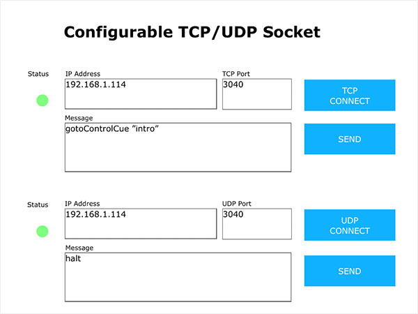

## ConfigurableSocket
On the fly socket IP address and port number reconfiguration on iViewer platform.

## Description
This sample project demonstrates the flexibility of iViewer platform which allow on-the-fly reconfiguration of socket IP address and port number. It works for both TCP and UDP socket and can be used for socket testing tool on mobile devices. For example: test sending a string payload to a specific IP address on it's specific port.

The module in this project contains minimal functions and remain as a working sample so it doesn't include other methods that you may find useful. Such as checking for a valid IP address input, sending HEX payload instead of ASCII or displaying the response through the feedback system.

## Usage
- Upload the project to a mobile device.
- Enter the IP address and port number of the remote device.
- Once connected, the status will show either green (connected) or red (disconnected).
- Enter the command in the message text field.

## Author
Eddy Yanto @ http://www.omnigram.net